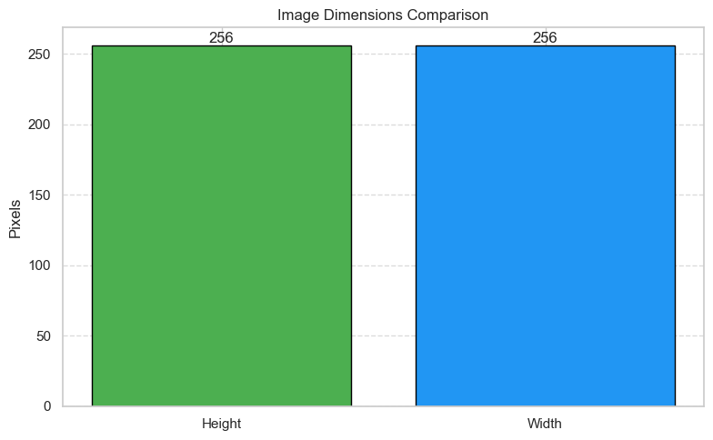

# Report 1: Exploration, Data Visualization, and Data Pre-processing Report

## Introduction to the Project

### Context

**Context of the project's integration into your business:**

The aim is to generate cost savings for farmers and optimize resources by enabling early detection of plant diseases.

**From a technical point of view:**

This can improve the efficiency of automated systems.

**From an economic point of view:**

The project could help farmers identify plant diseases early, potentially saving affected crops.

**From a scientific point of view:**

The project can serve as a foundation for further research in agricultural science and botany by providing insights into disease spread and progression.

### Objectives

**What are the main objectives to be achieved?**

The model should be able to distinguish the leaves of different plant species. Furthermore, it should differentiate between healthy and diseased leaves.

**Expertise of team members regarding the problem:**

Neither team member has experience with the technical aspects of image classification or the biological background of plant diseases.

**Have you contacted business experts to refine the problem and models?**

No, we haven’t.

**Are you aware of similar projects in your company or network?**

No, we are not aware of any similar projects.

## Understanding and Manipulation of Data

### Framework

**Which dataset(s) did you use to achieve your objectives?**

We used the dataset (Version 2) from the following website: [Kaggle Plant Diseases Dataset](https://www.kaggle.com/datasets/vipoooool/new-plant-diseases-dataset)

**Are these data freely available?**

Yes, the data is available on Kaggle and free to use.

**Describe the volume of your dataset:**

The dataset includes 87,868 images categorized into 38 different classes. It is split into an 80/20 ratio for training and validation sets.

### Relevance

**Which variables are most relevant for your objectives?**

Since we work with images, the images themselves and the extracted feature vectors are most relevant.

**What is the target variable?**

The label variable is our target.

**What features can you highlight?**

- 38 classes of healthy and diseased plant leaves
- High-quality, well-organized images
- Original image size: 256x256 pixels

**Are there limitations in your data?**

Yes. Some plants only have healthy images, making disease prediction impossible. Others only have diseased images, which are excluded from the analysis.

## Pre-processing and Feature Engineering

**Did you clean and process the data?**

Yes. The data was already split into augmented training and test sets. We processed the images by extracting features using the pre-trained CNN “MobileNetV2.”

**Did you apply normalization/standardization?**

Yes. We loaded the images, converted them to arrays, normalized them to a (-1, 1) range, and resized them to 224x224 pixels.

**Are you considering dimensionality reduction techniques?**

To be addressed (TBA).

## Visualizations and Statistics

**Have you identified relationships between variables?**

No.

**Describe the distribution, outliers, etc., pre/post-processing:**

- **Graph 1:** Shows 14 different plant types. Tomato has the most images, likely due to its many disease categories.

- **Graph 2:** Shows the number of diseased vs. healthy images per plant. Some diseases are overrepresented.

- **Graph 3:** Shows data count by plant type grouped by disease. Data appears generally balanced across all 38 classes.

- **Graph 4:** Displays extracted perceptual brightness with thresholds for identifying images that are too bright or too dark.

- **Graph 5:** Vizulises the size of the pictures.

**Present the statistical analyses used:**

None applied, due to the nature of the data.

## Conclusions

The dataset provides a solid foundation for working with image data. The first phase of modeling will predict plant type. The second phase will classify disease type.
